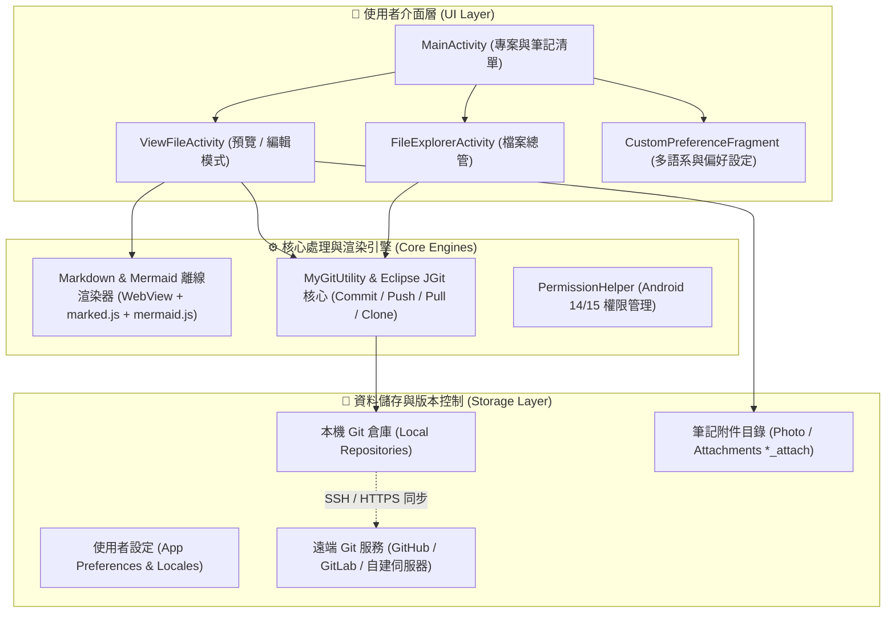
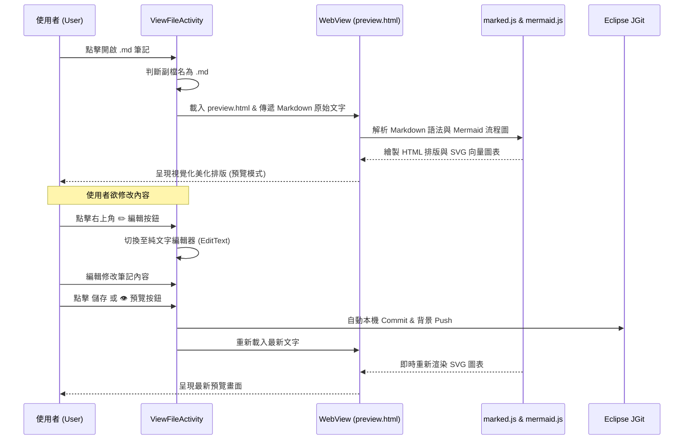
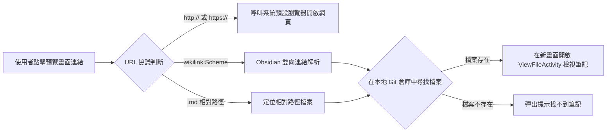
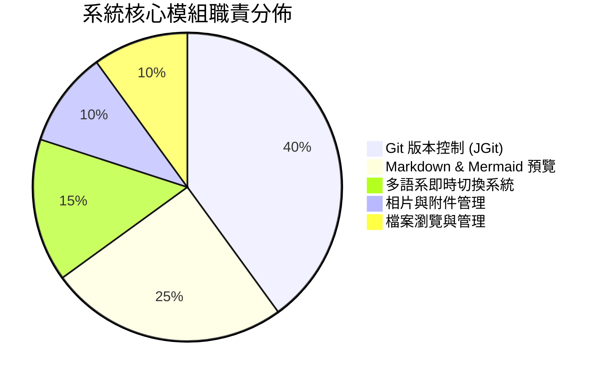

# InMethodGitNoteTaking 系統架構設計文件 (System Architecture)

本文件詳細記錄 InMethodGitNoteTaking（GIT文字筆記）的整體系統架構、離線 Markdown / Mermaid 渲染子系統、Git 版本控制資料流以及雙模式切換流程。此文件同時作為 App 內 Markdown 與 Mermaid 圖表渲染之標準測試檔案。

---

## 🏛️ 1. 系統整體分層架構 (Layered Architecture)

應用程式採用模組化分層架構，將 UI 互動、離線渲染、Git 核心服務與檔案儲存解耦：

---

## 🔄 2. Markdown 預覽與編輯雙模式資料流 (Dual-Mode Lifecycle)

當使用者開啟副檔名為 `.md` 或 `.markdown` 之筆記時，系統將自動啟動視覺化預覽流水線：

---

## 🧭 3. 雙向筆記跳轉與連結路由 (Wikilink & Link Navigation)

支援 Obsidian 雙向連結語法（`[[筆記名]]` 或 `[[筆記名|別名]]`）與外部網址跳轉：

---

## 📊 4. 模組功能與語系分佈範例 (Diagram Feature Showcase)

### 各模組核心職責圓餅圖：

---

## 🛠️ 相關技術規格與測試

- **測試指南**：請參閱 [`TESTING.md`](TESTING.md) 了解單元測試與自動化測試套件。
- **功能規範**：請參閱 `openspec/specs/` 了解各項功能變更與歷史規格。
