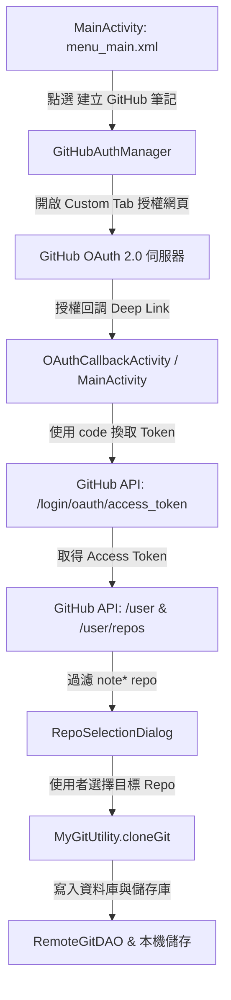

# Design: 建立 GitHub 筆記與 OAuth 授權整合

## Architecture Overview

本變更旨在為使用者提供免手動建立 PAT、一鍵授權即可建立 GitHub 筆記本的現代化體驗。



## Detailed Component Design

### 1. GitHub OAuth 與 API 管理模組 (`GitHubAuthManager.java`)
- **授權跳轉**：
  - URL: `https://github.com/login/oauth/authorize?client_id={CLIENT_ID}&scope=repo%20read:user&redirect_uri=gitnotetaking://oauth/github`
  - 使用 `androidx.browser.customtabs.CustomTabsIntent` 提供平滑的應用程式內網頁瀏覽體驗。
- **Token 換取**：
  - POST `https://github.com/login/oauth/access_token`
  - 帶入 `client_id`, `client_secret`, `code`, `redirect_uri`。
  - Header: `Accept: application/json`
- **使用者與儲存庫查詢**：
  - GET `https://api.github.com/user`（取得登入帳號名稱 `login`）。
  - GET `https://api.github.com/user/repos?per_page=100&sort=updated`（取得所有儲存庫）。

### 2. 儲存庫過濾與選取介面
- **過濾邏輯**：
  ```java
  List<GitHubRepo> noteRepos = new ArrayList<>();
  for (GitHubRepo repo : allRepos) {
      if (repo.getName().toLowerCase().startsWith("note")) {
          noteRepos.add(repo);
      }
  }
  ```
- **Repo 選取對話框**：
  - 若 `noteRepos.size() > 0`：以 `AlertDialog` 列出 Repo 名稱與描述，點選後啟動 Loading Dialog 並進行 Clone。
  - 若 `noteRepos.isEmpty()`：彈出提示對話框提醒「未找到以 note 開頭的 GitHub Repository」，並提供按鈕一鍵開啟瀏覽器建立新 Repo (`https://github.com/new`)。

### 3. 主選單與舊介面清理
- `menu_main.xml`：加入 `action_create_github_git`，設定圖示為 Octocat 圖示。
- `activity_clone_git.xml` / `CloneGitActivity.java`：移除 `searchButton` 與 `tvRegistration`。

## Security & Guardrails
- **Token 安全**：OAuth Token 做為密碼儲存於本機 SQLite 資料庫（`RemoteGit` 表）中，傳輸一律採用 HTTPS 加密。
- **錯誤處理**：若網路斷線、Token 換取失敗或 JGit Clone 失敗，皆主動彈出 Toast 或 AlertDialog 提示詳細原因。
