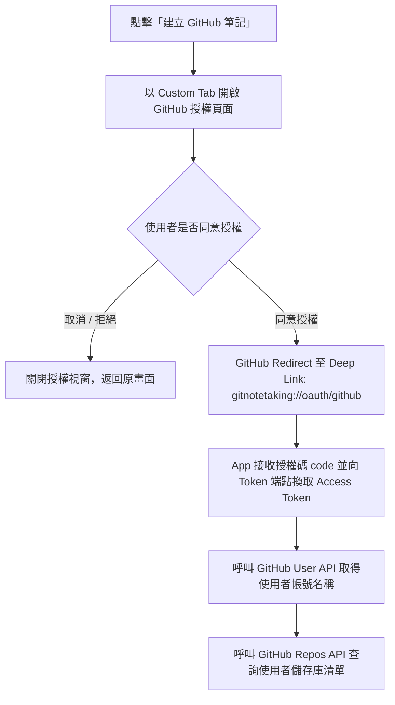
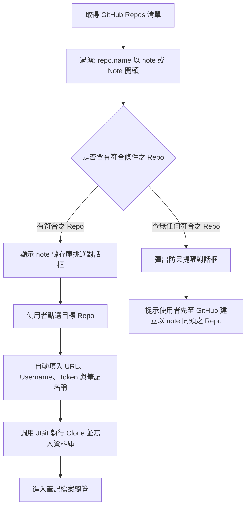

## Purpose

定義 InMethodGitNoteTaking 應用程式中「建立 GitHub 筆記」功能、GitHub OAuth 2.0 授權登入機制、`note*` 儲存庫過濾挑選與無儲存庫防呆指引之完整規格。

## ADDED Requirements

### Requirement: 主選單建立 GitHub 筆記入口
主畫面右上角「建立」選單 MUST 新增「建立 GitHub 筆記」選項，並顯示 GitHub Octocat 圖示，點擊後觸發 GitHub 授權流程。

#### Scenario: 點選主選單之建立 GitHub 筆記
- **WHEN** 使用者在主畫面點開「建立」選單並選擇「建立 GitHub 筆記」
- **THEN** 系統開啟 GitHub OAuth 授權流程

### Requirement: GitHub OAuth 2.0 授權與 Token 獲取
系統 MUST 透過 Chrome Custom Tabs 或外部瀏覽器開啟 GitHub 授權頁面（要求 `repo` 與 `read:user` 權限）。使用者授權後，系統 MUST 透過自訂 Deep Link 回調接收授權碼並換取 Access Token 與 GitHub 使用者資訊。

#### Scenario: 成功完成 GitHub 授權
- **WHEN** 使用者在 GitHub 授權頁面點擊「Authorize」
- **THEN** 系統自動接收回調並換取 Access Token，隨後載入使用者的 Repository 清單

#### Scenario: 使用者取消授權
- **WHEN** 使用者在授權頁面點擊取消或直接關閉瀏覽器
- **THEN** 系統安全返回主畫面，不拋出錯誤

### Requirement: note 前綴儲存庫過濾與選取
系統獲取使用者的 Repository 清單後，MUST 自動過濾名稱開頭為 `note`（不區分大小寫，例如 `note-work`、`NoteTaking`）之儲存庫並呈現於對話框供使用者挑選。使用者挑選後，系統 MUST 自動帶入 Repo 資訊、Username 與 Access Token 執行 JGit Clone 下載並建立筆記。

#### Scenario: 選擇筆記儲存庫並克隆
- **WHEN** 使用者從過濾清單中選擇一個 note 開頭之儲存庫
- **THEN** 系統自動以取得之 Token 與帳號完成 Clone 並加入至本機筆記清單

### Requirement: 查無 note 前綴儲存庫之防呆指引
若使用者的 GitHub 帳號中未查詢到任何名稱以 `note` 開頭之儲存庫，系統 MUST 彈出友善提示對話框，說明應用程式僅支援同步開頭為 `note` 的儲存庫，並提供指引與按鈕供使用者前往 GitHub 建立新儲存庫。

#### Scenario: 帳號內無任何 note 儲存庫時顯示提示
- **WHEN** 使用者授權成功但帳號內無任何名稱以 `note` 開頭之儲存庫
- **THEN** 系統彈出提示對話框，指引使用者先在 GitHub 建立名稱以 note 開頭的 Repository

### Requirement: 清理舊有 Click to Sign Up 介面
`CloneGitActivity` 介面中原有的 `searchButton` 與 `tvRegistration`（Click to Sign Up）MUST 予以移除，維持介面整潔乾淨。

#### Scenario: 開啟一般遠端 Git 複製畫面
- **WHEN** 使用者開啟「複製遠端筆記」畫面
- **THEN** 畫面不再顯示 Click to Sign Up 連結與圖示
