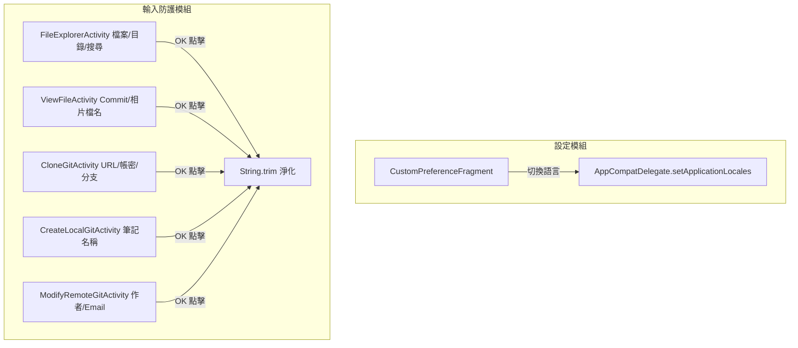

## Context

請參閱 `proposal.md - Why`。
專案已具備繁中 (TW/HK)、簡中 (CN)、日文 (JA) 與英文 (EN) 之資源檔，但在設定中缺少切換選單。同時，使用者在新增檔案、目錄、筆記或輸入 Git URL 與認證資訊時，首尾容易夾帶多餘空格，需於 OK 觸發點全面加入 `.trim()` 自動淨化。

## Goals / Non-Goals

**Goals:**
- 在 `settingspreferences.xml` 與 `CustomPreferenceFragment` 實作語言切換 `ListPreference`。
- 支援 5 種選項：跟隨系統 (`system`)、繁體中文 (`zh-TW`)、簡體中文 (`zh-CN`)、日本語 (`ja`)、English (`en`)。
- 在全專案所有文字輸入點之確認回呼（OK listener）加入 `.trim()` 淨化與空字串阻擋。

**Non-Goals:**
- 不改變 Git 底層通訊與儲存庫演算法。

## Decisions

### 1. 語言切換架構
- **決策**：採用 AndroidX `AppCompatDelegate.setApplicationLocales(LocaleListCompat.forLanguageTags(tag))`。
- **考量**：官方標準 API，支援 Android 13+ 系統級 Per-App Language 設定與向下相容。

### 2. 靜默 Trim 與防呆原則
- **決策**：按下 OK 立即自動執行 `.trim()`，絕不彈出額外詢問視窗；若過濾後為空，Toast 提示「不可為空」並終止。
- **考量**：大幅降低使用者操作中斷感，同時防止非法空檔名與 Git 認證失敗。
