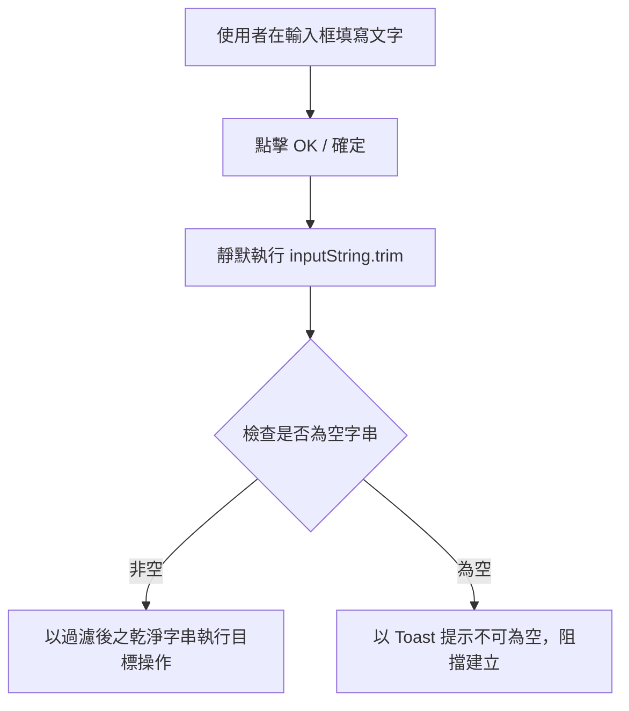

## Purpose

定義 InMethodGitNoteTaking 應用程式所有文字輸入框在使用者按下「OK」時自動過濾首尾空白（.trim()）與空值阻擋之安全規範。

## ADDED Requirements

### Requirement: 靜默自動過濾前後空白與防呆
全專案所有文字輸入（包含檔案名稱、資料夾名稱、Git URL、帳號、密碼/Token、筆記本名稱、作者姓名、Email、分支名稱、Commit 訊息、相片檔名等）在使用者點擊「OK」或確認按鈕時，系統 MUST 靜默自動過濾首尾空白，且在過濾後為空值時阻擋操作。

#### Scenario: 輸入帶有首尾空白之名稱時自動過濾
- **WHEN** 使用者輸入帶有前後空格之文字（如 `"  MyNote  "`）並按下 OK
- **THEN** 系統自動轉為 `"MyNote"` 並執行新增，不彈出多餘確認詢問

#### Scenario: 輸入純空格時阻擋建立
- **WHEN** 使用者輸入全為空白字元並按下 OK
- **THEN** 系統阻擋操作並顯示「不可為空」提示訊息
