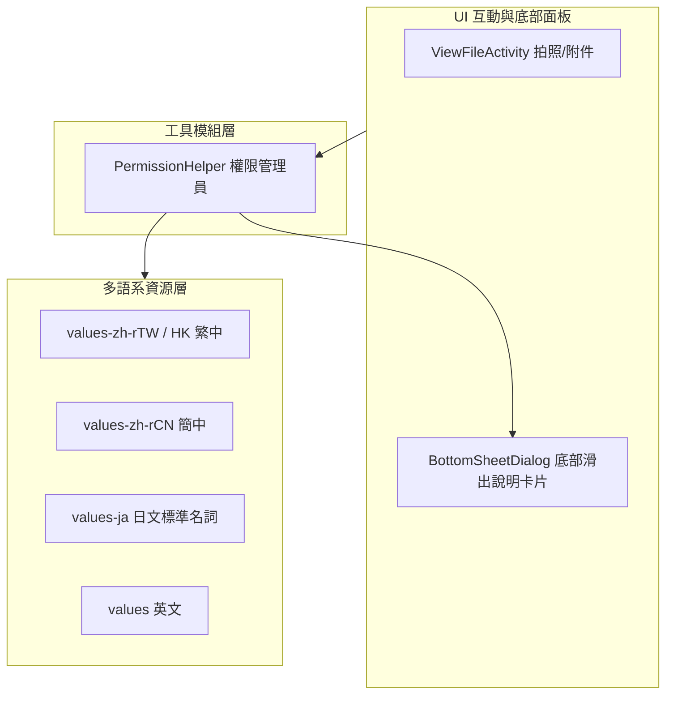

## Context

請參閱 `proposal.md - Why`。
現有專案在 `MainActivity.onCreate()` 中開機無條件透過 `requestPermission()` 索取全部權限，且缺少前置說明對話框與拒絕時的防呆機制。同時，專案現僅支援英文與繁體中文，需擴充簡體中文與日文以提升國際化支援度並保持排版整齊。

經過 `/grill-me` 深入對齊，確定採用 **現代化底部滑出面板 (BottomSheetDialog)** 呈現權限說明，並在拒絕時採**靜默退出**、永久拒絕時透過**底部面板引導跳轉系統設定頁面**。

## Goals / Non-Goals

**Goals:**
- 實作 `PermissionHelper` 模組，封裝以 `BottomSheetDialog` 為核心的前置說明面板、靜默取消、防呆阻擋與跳轉設定頁功能。
- 移除 `MainActivity` 開機強制索取權限，實現按需請求（Just-In-Time）。
- 在 `ViewFileActivity` 拍照與附件操作中整合權限檢查與底部面板前置說明。
- 建立 `values-zh-rCN/strings.xml` 與 `values-ja/strings.xml`（日文採用標準日系簡短名詞風格），並更新現有語系檔之權限字串。

**Non-Goals:**
- 暫不引入超長單字之德文語系，避免 UI 跑版。
- 不變更現有 Git 核心同步與資料庫邏輯。

## Decisions

### 1. 權限前置告知與 BottomSheetDialog 介面樣式
- **決策**：在使用者點擊拍照或附件功能時，若未授權，自畫面底部滑出 `BottomSheetDialog` 卡片式面板，呈現清晰圖示、權限用途說明、「同意並授權」及「暫不同意」按鈕。點擊同意才向系統發起請求；點擊暫不同意則靜默關閉面板，不顯示多餘 Toast 且絕對不調用系統請求。
- **考量**：符合 Google Play 政策要求，並兼顧現代化 Material 視覺體驗與不干擾使用者的互動原則。

### 2. 永久拒絕（不再詢問）之引導機制
- **決策**：若使用者曾勾選「不再詢問」導致無法跳出系統授權視窗，再次點選該功能時，以相同的底部面板顯示「需要開啟權限」說明，並提供「前往設定」按鈕（調用 `Settings.ACTION_APPLICATION_DETAILS_SETTINGS` 一鍵跳轉）與「取消」按鈕。
- **考量**：一致的底部面板體驗，降低使用者理解成本。

### 3. 多語系風格與防跑版策略
- **決策**：
  - 簡體中文 (`zh-rCN`)：字數與繁中 1:1，確保零跑版。
  - 日文 (`ja`)：採用標準日系工具名詞（如「撮影」「保存」「設定」「コミット」），詞長精簡，排版整齊不溢出。
  - 一律透過 `context.getString(R.string.xxx)` 調用，不寫死任何字串。

## Risks / Trade-offs

- **[風險] 使用者在系統設定開啟權限後返回 App** → **[緩解措施]** 在 Activity 的 `onResume` 或再次點擊功能時即時重新檢查 `checkSelfPermission`，無需重啟 App 即可順暢運作。
