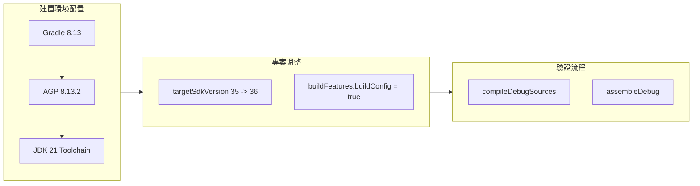

## Context

請參閱 `proposal.md - Why`。
目前專案已升級至 Gradle 8.13、Android Gradle Plugin (AGP) 8.13.2，並透過 Foojay JVM Toolchain 自動佈署 JetBrains JDK 21。`compileSdkVersion` 已設定為 `36`，`minSdkVersion` 為 `33`。本設計聚焦於將 `targetSdkVersion` 提升至 `36` 並進行相應的建置與相容性調整。

## Goals / Non-Goals

**Goals:**
- 將 `app/build.gradle` 的 `targetSdkVersion` 升級為 `36`。
- 顯式配置 `android.buildFeatures.buildConfig = true` 確保建置無警告。
- 驗證專案在 API 36 設定下能順利通過完整編譯與打包 (`assembleDebug`)。

**Non-Goals:**
- 不調整 `minSdkVersion 33`（維持 Android 13+ 支援）。
- 不重構既有 JGit 邏輯或 UI 佈局。

## Decisions

### 1. 升級 Target SDK 為 36
- **決策**：在 `app/build.gradle` 的 `defaultConfig` 區塊中將 `targetSdkVersion` 由 35 更新為 36。
- **考量**：符應 Google Play 最新規範，並沿用現有 `MyApplication.setView()` 的 WindowInsets / Edge-to-Edge 邊到邊實作。

### 2. 顯式宣告 buildFeatures.buildConfig
- **決策**：在 `android { ... }` 區塊加入 `buildFeatures { buildConfig = true }`。
- **考量**：AGP 8.0+ 預設不產生 BuildConfig，雖然本專案透過 properties 啟用，但顯式宣告可避免未來升級 AGP 10 時發生錯誤。

## Risks / Trade-offs

- **[風險] Android 16 執行期未知 API 行為變更** → **[緩解措施]** 專案無使用 JNI/NDK 原生 C/C++ 庫（天然相容 16KB Page Size），且 Activity 均已有 Edge-to-Edge 邊距適配，風險極低。透過 `assembleDebug` 確保編譯與打包無誤。
