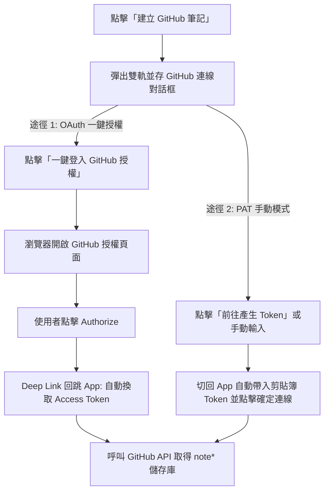

## MODIFIED Requirements

### Requirement: GitHub Token 獲取與剪貼簿自動辨識
系統 MUST 在 GitHub 連線對話框中提供「一鍵 OAuth 授權」與「PAT 手動輸入」雙軌並存機制。
1. **OAuth 一鍵授權**：提供顯著的【一鍵登入 GitHub 授權】按鈕，點擊後透過 Chrome Custom Tabs 開啟授權頁面，使用者同意授權後，系統 MUST 透過 Deep Link（`gitnotetaking://oauth/github`）自動接收回調並換取 Access Token，直接進入儲存庫挑選流程。
2. **PAT 手動輸入**：提供【前往產生 Token】按鈕自動開啟預選權限頁面，並在使用者複製切回時自動辨識剪貼簿內容填入輸入框，點擊【確定連線】後進入儲存庫挑選流程。

#### Scenario: 成功透過 OAuth 一鍵授權取得儲存庫
- **WHEN** 使用者在對話框點擊「一鍵登入 GitHub 授權」並在瀏覽器完成授權
- **THEN** 系統透過 Deep Link 接收授權碼、換取 Token 並自動取得儲存庫清單

#### Scenario: 成功透過 Token 取得儲存庫
- **WHEN** 使用者輸入或由剪貼簿帶入有效之 GitHub Token 並點擊「確定連線」
- **THEN** 系統透過 API 獲取使用者的 Repository 清單並進入篩選流程
