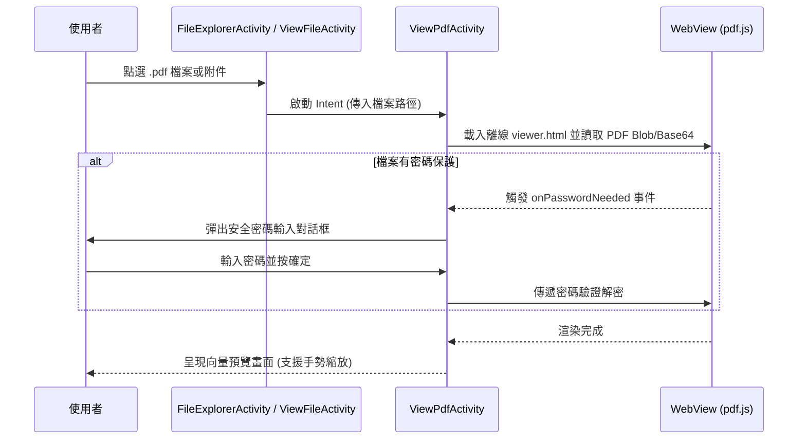

## Context

目前 App 檢視 `.pdf` 檔案時皆透過 `Intent.ACTION_VIEW` 委派給第三方應用程式處理。為了提供統一的離線文件檢視體驗，需在 App 內建構 PDF 離線預覽介面，並原生支援加密/密碼保護 PDF 之解鎖流程。

## Goals / Non-Goals

**Goals:**
- 提供專屬之 `ViewPdfActivity`（或整合至 `ViewFileActivity`），在完全離線環境下流暢預覽 PDF 內容。
- 支援標準 PDF 密碼保護，遇到加密檔案自動提示輸入密碼並即時解密。
- 提供手勢雙指縮放 (Pinch-to-zoom)、上下滑動翻頁與深淺色主題自適應。
- 支援檔案清單點選與筆記底部附件列點選之雙重入口。
- 保留右上角「外部開啟」選單項目，維護原有 FileProvider 分享相容性。

**Non-Goals:**
- 不包含在 App 內部直接對 PDF 進行複雜的筆記劃記、手寫簽名或頁面旋轉/重組（使用者如有此需求，可透過「外部開啟」交由專業工具處理）。
- 不實作 PDF 檔案之二進位編輯與編譯功能。

## Decisions

### 決策 1：採用輕量離線 `pdf.js` + WebView 混合架構
- **理由**：
  - `pdf.js` (Mozilla) 具備完整的 100% 離線向量繪製引擎與成熟的密碼保護解密協議（支援 RC4/AES 128/256 等多種標準加密演算法）。
  - 架構與目前的 Markdown / Mermaid 離線渲染模式高度一致，容易維護與進行跨平台縮放適配。
  - 當遇到密碼保護時，可無縫透過 JavaScript 介面與 Android Native AlertDialog 進行密碼回調傳遞。
- **替代方案評估**：
  - *Android 原生 PdfRenderer*：API 21+ 內建，但其對加密 PDF 的密碼解密支援需 Android 15+ 或引入額外 native 庫，且手勢縮放多頁面管理較繁瑣。

### 決策 2：專屬 `ViewPdfActivity` vs `ViewFileActivity` 模式共用
- **理由**：
  - 建立專屬的 `ViewPdfActivity` 處理 PDF 的全螢幕檢視、頁面導航與密碼輸入，與以文字編輯為主的 `ViewFileActivity` 分離，職責分明且降低複雜度。
  - 在 `FileExplorerActivity` 與 `ViewFileActivity`（附件點擊）中，若 MIME 或副檔名為 `.pdf`，直接發送 Intent 跳轉 `ViewPdfActivity`。

### 決策 3：升級主題為 AppCompat.DayNight 架構
- **理由**：
  - 將 `styles.xml` 的 `AppTheme` 父類升級為 `Theme.AppCompat.DayNight.DarkActionBar`（或 `ThemeOverlay` 配合）。
  - 在 `res/values-night/` 中配置深色背景色、深色卡片底色與高對比文字色。
  - 當系統深淺色設定變更時，Android 系統與 AppCompat 會自動重構資源，Activity 自動平滑更新色彩。

## Risks / Trade-offs

- **[Risk: 大型 PDF 檔案載入記憶體壓力]** → 採用分頁漸進式渲染 (Lazy Page Rendering)，僅解碼當前螢幕可見之頁面。
- **[Risk: 密碼安全性]** → 使用者輸入之密碼僅存在於記憶體中傳遞給解密核心，不寫入任何本地資料庫或日誌中。
- **[Risk: 特殊損壞 PDF 檔案]** → 提供優雅降級提示，並提供按鈕引導使用者使用外部專業 PDF Reader 開啟。
- **[Risk: 夜間模式圖示或文字反白問題]** → 全面檢視列表項目圖示、按鈕與編輯框，採用 `?android:attr/textColorPrimary` 與主題相關屬性，杜絕深底深字。

