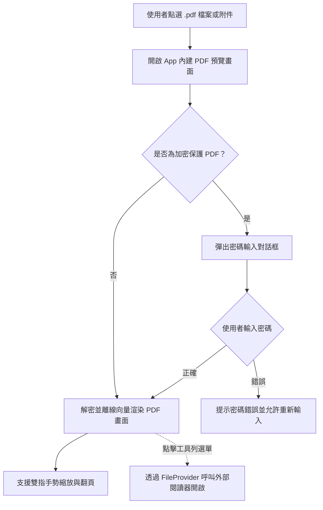

## Purpose

提供 InMethodGitNoteTaking 應用程式中獨立 PDF 檔案與筆記附件 PDF 之 100% 離線原生預覽、手勢縮放、密碼保護檔案解鎖與外部閱讀器轉發之完整行為規格。

## ADDED Requirements

### Requirement: App 內原生 PDF 離線預覽
應用程式 MUST 支援在檔案清單或筆記附件列中點選 `.pdf` 檔案時，於 App 內部原生畫面加載並離線渲染 PDF 內容，支援雙指縮放、滑動翻頁與深淺色介面適配，無需強制跳轉至外部應用程式。

#### Scenario: 成功預覽一般 PDF 檔案
- **WHEN** 使用者在檔案清單或筆記附件列中點擊未加密的 `.pdf` 檔案
- **THEN** 系統直接在 App 內部載入並渲染 PDF 內容，呈現清晰的向量頁面與頁碼

#### Scenario: 手勢縮放與翻頁操作
- **WHEN** 使用者在 PDF 預覽畫面執行雙指縮放或上下滑動
- **THEN** 畫面流暢放大/縮小頁面細節並切換至不同頁數

### Requirement: 密碼保護 PDF 互動式解密
應用程式 MUST 能自動識別有密碼保護（加密）之 PDF 檔案。當偵測到加密 PDF 時，MUST 於 App 內彈出安全密碼輸入對話框，待使用者輸入正確密碼後立即解密呈現；若密碼錯誤，MUST 顯示明確提示並允許重新輸入或取消。

#### Scenario: 遇到加密 PDF 提示輸入密碼
- **WHEN** 使用者點擊包含密碼保護的 `.pdf` 檔案
- **THEN** 系統自動彈出「請輸入 PDF 開啟密碼」之安全對話框

#### Scenario: 輸入正確密碼成功解鎖
- **WHEN** 使用者在密碼對話框中輸入正確密碼並確認
- **THEN** 系統即時解密該 PDF 並在 App 內正常呈現檔案內容

#### Scenario: 應用程式運行期間記憶體暫存密碼
- **WHEN** 使用者在當前應用程式運行生命週期中曾成功解鎖過該 PDF 檔案並再次開啟
- **THEN** 系統直接使用記憶體中暫存之密碼解密載入，無需重複彈出密碼輸入框；當 App 關閉/重啟後該暫存自動清空

#### Scenario: 輸入錯誤密碼防呆提示
- **WHEN** 使用者輸入錯誤之密碼並確認
- **THEN** 系統顯示密碼錯誤之提示訊息，並保留對話框供使用者重新嘗試

### Requirement: 外部閱讀器轉發與分享
應用程式 MUST 在 PDF 預覽畫面工具列提供「外部開啟」或「分享」選項，允許使用者在需要進行專業標註、手寫簽名或列印時，透過 Android `FileProvider` 安全跳轉至系統安裝之第三方 PDF Reader。

#### Scenario: 點擊外部開啟選單
- **WHEN** 使用者在 PDF 預覽畫面點擊右上角工具列之「外部開啟」按鈕
- **THEN** 系統透過 FileProvider 安全分享該 PDF URI 並喚起系統應用程式選擇器供使用者挑選
