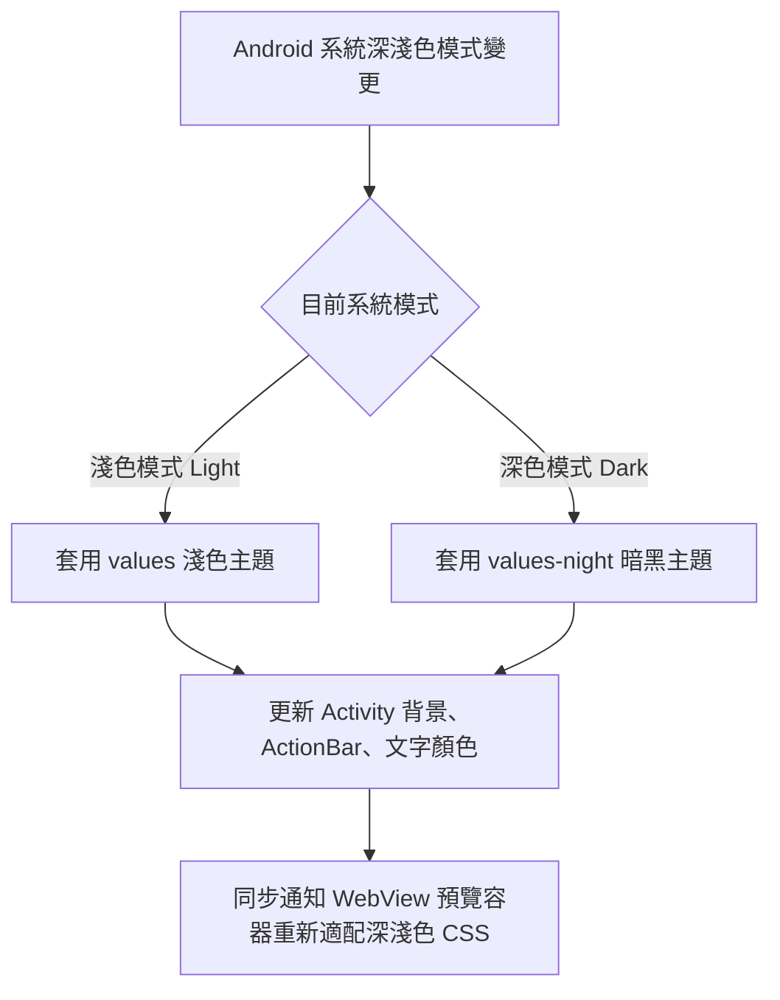

## Purpose

提供 InMethodGitNoteTaking 應用程式全介面（包含主畫面、檔案總管、文字編輯器、對話框、設定頁面以及 Markdown/PDF 預覽容器）100% 主動跟隨 Android 系統深淺色 (DayNight) 主題切換之行為規範。

## ADDED Requirements

### Requirement: 全 App 原生介面主動跟隨系統深淺色主題
應用程式 MUST 採用 `DayNight` 主題架構，當 Android 系統切換為深色模式（Dark Theme / Night Mode）或淺色模式（Light Theme）時，全應用程式之 ActionBar、Toolbar、Activity 背景、檔案清單卡片、文字編輯框、對話框與設定選單 MUST 自動即時響應並套用相應主題，無需使用者手動重啟應用程式。

#### Scenario: 系統切換為夜間深色模式
- **WHEN** Android 系統設定開啟「深色主題 (Dark Theme)」
- **THEN** 應用程式所有 Activity 背景自動轉為深黑/深灰配色，主要文字轉為高對比白色/淺灰色，ActionBar 與圖示呈現深色主題風格

#### Scenario: 系統切換為日間淺色模式
- **WHEN** Android 系統設定開啟「淺色主題 (Light Theme)」
- **THEN** 應用程式所有 Activity 背景自動切換為經典亮色，文字轉為深黑色

### Requirement: 夜間模式色彩對比與可讀性保證
應用程式在夜間深色模式下 MUST 確保所有文字、圖示、分隔線與按鈕具備符合 WCAG 標準之高對比度，避免出現深底深字或刺眼純白塊狀失真，且文字編輯框之游標（Cursor）與選取範圍在深色底色下 MUST 清晰可見。

#### Scenario: 編輯器夜間模式輸入體驗
- **WHEN** 使用者在夜間深色模式下進入筆記編輯模式
- **THEN** 編輯框背景為深色、文字為淺色、游標顏色高亮可辨識，提供舒適之護眼輸入體驗

### Requirement: 偏好設定手動覆蓋主題選項
應用程式 MUST 在偏好設定（Settings）中提供主題模式選單，包含「跟隨系統 (System Default)」、「淺色模式 (Light)」與「深色模式 (Dark)」三種選項，使用者切換後 MUST 即時套用至整個應用程式。

#### Scenario: 手動切換為深色模式
- **WHEN** 使用者在設定中將主題改選為「深色模式」
- **THEN** 應用程式全介面立即切換為暗黑夜間風格並持久化儲存偏好設定

