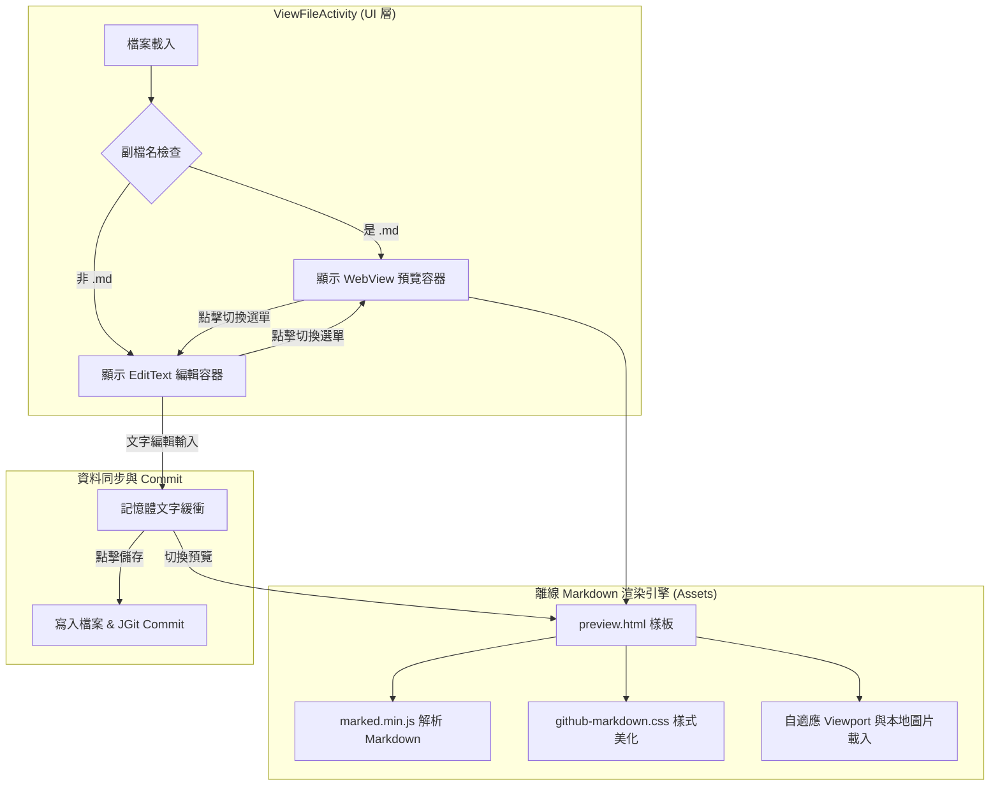

## Context

目前 `ViewFileActivity` 使用傳統 `ScrollView` 包裹 `EditText`，因缺少 `fillViewport="true"` 與高度約束設定，導致短文字在手機畫面上留有大面積無法點擊的死區。此外，閱讀 Markdown 檔案時缺乏美化預覽能力。

參見 `proposal.md` 了解完整背景與動機。

## Goals / Non-Goals

**Goals:**
- 修復 `activity_view_file_content.xml` 佈局約束，達成 100% 垂直滿版與任意空白處可點擊編輯。
- 引入純本地、100% 離線的 WebView + Marked.js + GitHub Markdown CSS 渲染架構。
- 支援 `.md` / `.markdown` 檔案預設預覽與「預覽 👁️ / 編輯 ✏️」無縫一鍵切換。
- 確保所有文字修改即時雙向連動，既有 Commit 存檔與附件功能零破壞。

**Non-Goals:**
- 不引入重型線上雲端 Markdown 渲染 API（堅持 100% 離線安全）。
- 不更動 Git 儲存庫同步或目錄樹瀏覽邏輯。

## Technical Architecture & Flow

## Decisions

### 1. 採用 Android 內建原生 WebView + 本地靜態 JS/CSS
- **決定**：將 `marked.min.js` 與 `github-markdown.css` 打包於 `app/src/main/assets/markdown/`，透過 WebView 載入本地 `preview.html` 進行渲染。
- **理由**：
  - **永遠不被廢棄**：WebView 與 Web 標準技術（HTML/CSS/JS）是 Android 系統的基礎架構，不會隨 Android 版本升級而面臨套件孤兒或棄用問題。
  - **100% 離線安全**：完全於手機記憶體與本地資產中運作，不需任何外網請求。
  - **排版相容性最強**：支援表格、清單方框、代碼區塊與圖片等完整語法，呈現效果與 Obsidian / GitHub 高度一致。
- **替代方案評估**：
  - *原生 TextView + Markwon*：雖然為原生繪製，但在複雜表格、複雜語法擴充與樣式微調上彈性較差，且有第三方套件停止維護之長期風險。

### 2. 佈局滿版與點擊穿透性優化 (ConstraintLayout + fillViewport)
- **決定**：
  - 在 `ScrollView` 加上 `android:fillViewport="true"`。
  - 將 `ScrollView` 與 `WebView` 高度設定為 `0dp`，頂部約束 `parent` 頂部、底部約束附件列上方。
  - 移除寫死的 `minLines="40"` 與 `marginBottom="30dp"`。
- **理由**：讓 `EditText` 與 `WebView` 能夠完美自適應手機螢幕高度，短文字時點擊螢幕中下方任意空白處皆可直接聚焦並叫起軟鍵盤打字。

### 3. 工具列模式切換控制項 (Toolbar Action Toggle)
- **決定**：在 `menu_view_file.xml` 新增切換按鈕，當目前處於預覽模式時顯示「編輯 (✏️)」圖示，處於編輯模式時顯示「預覽 (👁️)」圖示。非 `.md` 檔案時自動隱藏該按鈕。
- **理由**：介面乾淨直覺，完全符合使用者「想看時直接看、想改時一鍵改」的閱讀與編輯心智模型。

## Risks / Trade-offs

- **[記憶體與效能]** WebView 初始化與渲染耗時 → **緩解**：僅在開啟 `.md` 檔案時初始化，且本地靜態 JS/CSS 載入時間小於 50ms，使用者無感。
- **[本地圖片相對路徑載入]** Markdown 中的圖片可能無法直接顯示 → **緩解**：設定 `WebSettings.setAllowFileAccess(true)` 並透過 base URL 指向當前 Git 筆記庫目錄，使相對路徑圖片可直接正常加載。
- **[編輯內容未儲存切換]** 切換回預覽時資料未同步 → **緩解**：在切換模式時自動將 `editFile.getText()` 之最新文字動態傳入 WebView 重新渲染，確保資料 100% 同步。
