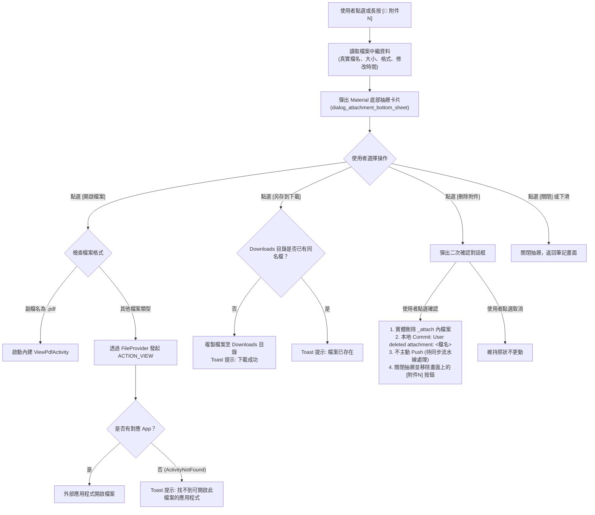

# Design: 筆記附件底部抽屜架構與互動設計

## Context

在目前 `ViewFileActivity` 中，當筆記目錄存在同名之 `<note>_attach` 資料夾時，系統會遍歷其中的檔案，並於水平滾動容器 `layoutAttachment` 中動態加入 `TextView` 按鈕（文字為 `附件1`、`附件2`）。
原先短按直接透過 `Intent.ACTION_VIEW` 或 `ViewPdfActivity` 開啟，長按彈出舊式 `PopupMenu`（下載與刪除）。詳細需求動機參見 `proposal.md`。

## Goals / Non-Goals

**Goals:**
- 短按與長按 `附件N` 標籤皆滑出現代化的 Material 底部抽屜 (`BottomSheetDialog`)。
- 在抽屜中完整展示檔案中繼資料：專屬類型圖示、真實檔案全名、格式化大小、格式類型描述與最後修改時間。
- 整合三大動作按鈕：
  1. 【開啟檔案】：安全呼叫內建 PDF 閱讀器或外部第三方應用程式。
  2. 【另存到下載 (Downloads)】：複製該檔案至手機公開 `Download` 目錄。
  3. 【刪除附件】：防呆確認後實體刪除、本地 Git Commit 純英文訊息、動態刷新筆記畫面。
- 完整適配 4 國語系與 App 深淺色主題（Dark / Light Mode）。

**Non-Goals:**
- 不改變筆記畫面上方橫向附件標籤外觀，維持顯示簡潔之 `附件1`、`附件2`。
- 圖片檔案維持與一般文件相同的資訊卡片排版，不展開圖片即時縮圖。
- 刪除附件時僅於本地 Git Commit，不主動發起背景 `git push`。

## 系統互動流程圖 (System Flowchart)



## Decisions

### 1. 採用 `com.google.android.material.bottomsheet.BottomSheetDialog`
- **決策**：抽屜使用 Material Components 既有的 `BottomSheetDialog`，並自訂版面 `dialog_attachment_bottom_sheet.xml`。
- **考量與替代方案**：
  - 傳統 `AlertDialog`：位於螢幕正中央，遮擋過多畫面且缺乏現代卡片感。
  - `BottomSheetDialogFragment`：需管理 Fragment 生命週期與 Context 傳遞，對於單一 Activity 內彈出的輕量資訊視窗顯得過度複雜。
  - 直接採用 `BottomSheetDialog`（專案內 `PermissionHelper` 已有成熟使用模式）最為輕量且效能最佳。

### 2. 檔案大小與時間格式化機制
- **決策**：
  - 檔案大小使用 Android 內建的 `android.text.format.Formatter.formatFileSize(context, file.length())`，自動支援各國語言的單位（B、KB、MB）。
  - 修改時間使用 `new SimpleDateFormat("yyyy-MM-dd HH:mm", Locale.getDefault()).format(new Date(file.lastModified()))`。

### 3. 操作行為整合（合併長按與短按）
- **決策**：短按與長按皆導向 `showAttachmentBottomSheet(...)`，將原先隱藏在長按選單的「下載」與「刪除」完整收錄至抽屜。
- **考量**：避免使用者不知道有長按功能，所有附件資訊與動作集中在抽屜卡片中呈現，互動最為直覺。

### 4. 刪除附件與 Git 提交流程
- **決策**：
  - 經使用者二次確認後實體刪除檔案。
  - 執行本地 Commit：
    ```java
    MyGitUtility.commit(context, sGitRemoteUrl, "User deleted attachment: " + file.getName());
    ```
  - **不執行** `MyGitUtility.push(...)`，維持本地輕量操作，交由離開筆記或主頁時的既有同步機制批次推送。

## Risks / Trade-offs

- **[Risk: 檔案已被外部或系統刪除]** → 在顯示抽屜前先呼叫 `file.exists()`，若檔案不存在則提示並自動自畫面中移除無效按鈕。
- **[Risk: 外部應用程式不存在導致崩潰]** → 呼叫 `startActivity(intent)` 時以 `try-catch (ActivityNotFoundException e)` 保護，並透過 `Toast.makeText` 顯示「找不到可開啟此檔案的應用程式」。
- **[Risk: 深色模式配色失衡]** → 卡片背景設定為 `?attr/colorSurface`，文字與圖示採用主題色系資源（如 `?android:attr/textColorPrimary` 與 `?android:attr/textColorSecondary`），深色模式下對比度符合 Material 規範。
