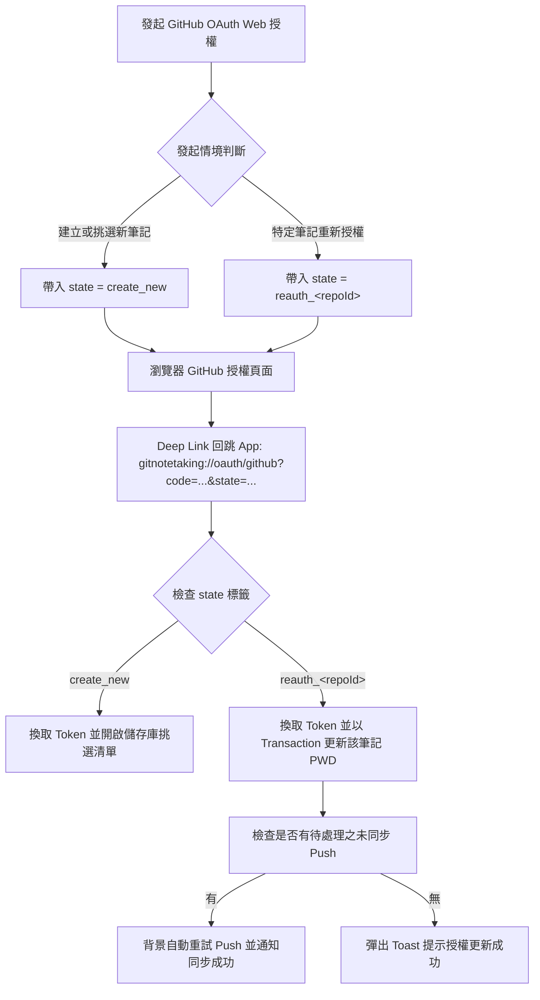
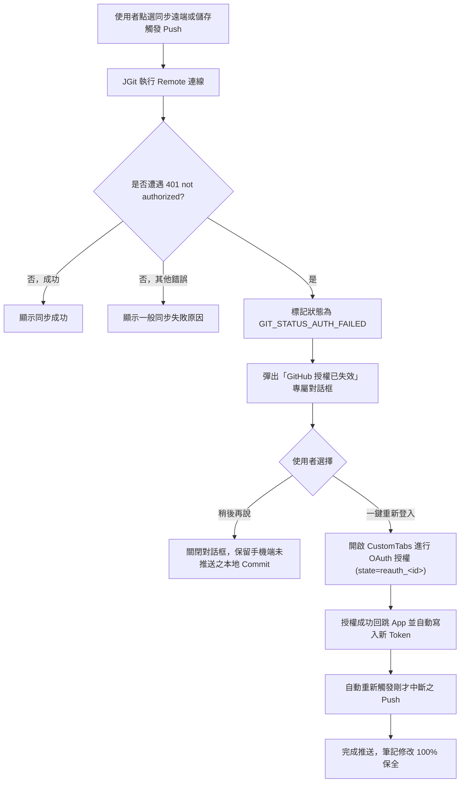

# Spec Delta: GitHub 授權續期、401 攔截自動續推與多語系 FAQ (github-integration)

## ADDED Requirements

### Requirement: OAuth State 路由分流與筆記重新綁定
系統在發起 GitHub OAuth 授權流程時，MUST 支援在授權網址中帶入 `state` 參數以記錄發起情境；在透過 Deep Link 接收授權碼時，MUST 依據回傳之 `state` 精準分流處理。

#### Scenario: 透過 Deep Link 接收帶有特定儲存庫標記之 state
- **WHEN** 使用者針對 ID 為 12 的儲存庫點選重新授權並在瀏覽器完成授權
- **THEN** 系統透過 Deep Link 接收到 `state=reauth_12`，自動將新換發之 Token 寫入 ID 為 12 之 `REMOTE_GIT` 記錄，並提示授權更新成功

#### Scenario: 建立新筆記時之預設 state 處理
- **WHEN** 使用者自主畫面點選「建立 GitHub 筆記」並完成授權
- **THEN** 系統透過 Deep Link 接收到 `state=create_new`，保持原有行為，列出使用者的 `note*` 儲存庫以供挑選下載

### Requirement: 401 授權失效主動攔截與斷點自動續推
當筆記執行 Git Push 或 Pull 遭遇遠端 GitHub 回傳 401 Unauthorized（`TransportException: not authorized`）時，系統 MUST 識別該狀態為 `GIT_STATUS_AUTH_FAILED`，並於介面彈出專屬授權過期引導對話框，引導使用者完成一鍵重新登入並自動背景續推未同步之修改。

#### Scenario: 同步遇到 401 拋出專屬授權過期對話框
- **WHEN** 筆記同步因 GitHub Token 過期導致遠端回傳 401 錯誤
- **THEN** 系統阻擋一般無效 Toast，改為彈出「GitHub 授權已失效」對話框，清楚說明可能是 8 小時授權過期，並提供【重新登入並同步】按鈕

#### Scenario: 重新授權成功後自動續推未同步筆記
- **WHEN** 使用者在 401 對話框中點選【重新登入並同步】並完成網頁授權回跳
- **THEN** 系統自動更新該筆記資料庫認證資訊，並在背景自動接續執行原本失敗之 Push 操作，推送成功後通知使用者，本地修改完全無損

#### Scenario: 使用者取消重新授權
- **WHEN** 使用者在 401 授權過期對話框中點選【取消】或【稍後】
- **THEN** 系統安全關閉對話框，維持本地 Git Commit 紀錄不被覆蓋或遺失

### Requirement: 儲存庫修改畫面之 GitHub 網頁重新授權入口
在「修改儲存庫」畫面 (`ModifyRemoteGitActivity`) 中，當目標儲存庫為 GitHub 遠端 URL 時，系統 MUST 提供【透過 GitHub 網頁重新授權】按鈕，供使用者無需手動複製貼上任何 Token 即可一鍵完成憑證刷新。

#### Scenario: 點擊修改儲存庫中的 GitHub 重新授權按鈕
- **WHEN** 使用者開啟任一 GitHub 筆記的修改畫面並點擊【透過 GitHub 網頁重新授權】
- **THEN** 系統以該儲存庫之 ID 啟動 Web OAuth 流程，完成後自動更新該畫面與資料庫中的使用者帳號與密碼欄位

### Requirement: 建立筆記清單支援已下載筆記之授權更新
在「建立 GitHub 筆記」之儲存庫挑選清單中，對於標記為【已下載】的儲存庫，系統 MUST 允許使用者點擊，並彈出更新確認對話框。

#### Scenario: 點擊已下載之筆記更新授權
- **WHEN** 使用者在儲存庫清單中點擊已被標記為已下載的筆記
- **THEN** 系統彈出對話框詢問「此筆記已在手機中，是否要為其更新授權？」，使用者確認後立即更新該筆記之 Access Token

### Requirement: 多語系 GitHub 授權設定與排錯指引 (FAQ)
專案 MUST 於 `docs/` 目錄建立繁體中文、簡體中文、英文與日文 4 國語系之 FAQ 指引文件，詳細記錄 GitHub OAuth 8 小時過期政策之背景成因、App 內一鍵復原步驟，以及 OAuth App 建立者關閉 "Expire user authorization tokens" 之圖文步驟。

#### Scenario: 提供 4 國語系 FAQ 說明文件
- **WHEN** 開發者或使用者查閱專案說明
- **THEN** 能在 `docs/FAQ.md`、`docs/FAQ_zh-CN.md`、`docs/FAQ_en.md` 與 `docs/FAQ_ja.md` 取得完整排錯說明與 OAuth App 永不過期之設定指引
