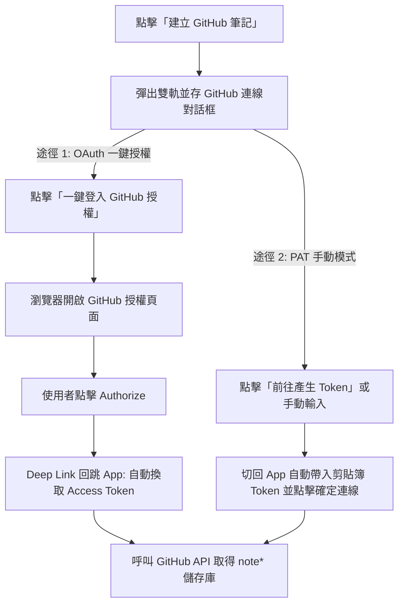
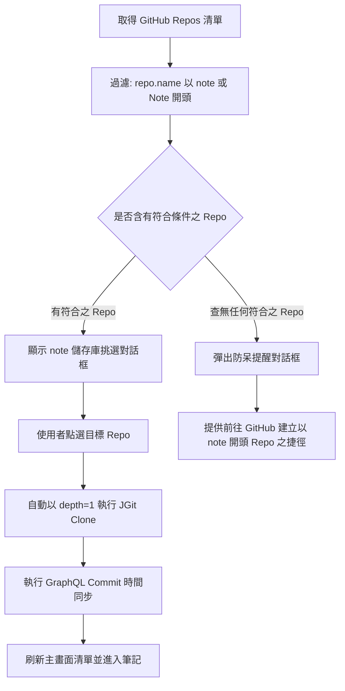
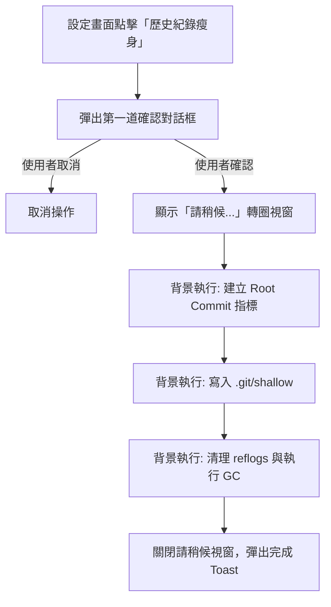
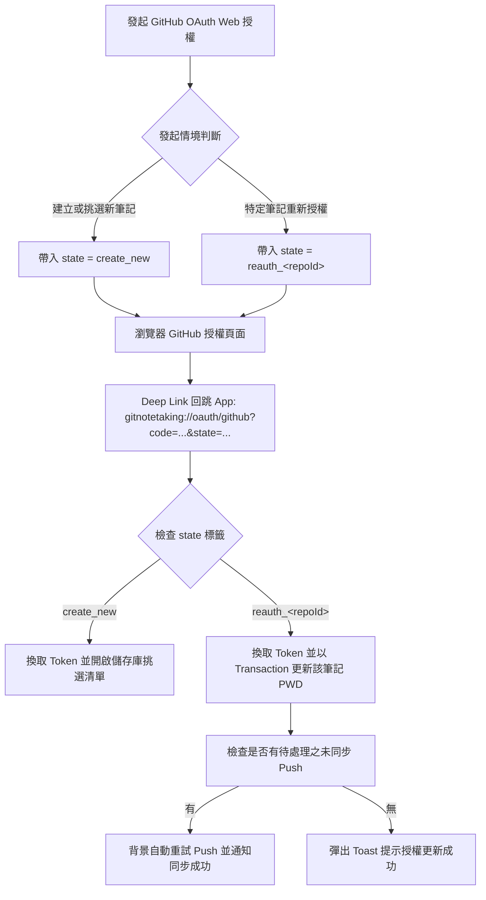
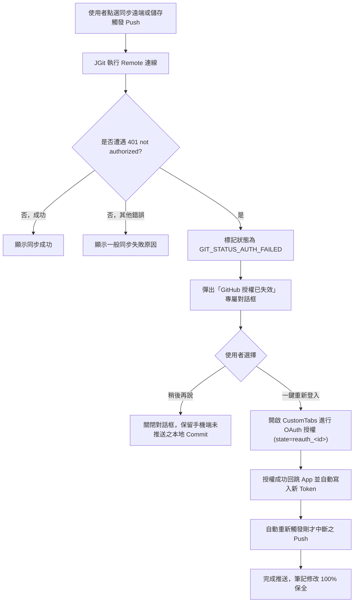

# github-integration Specification

## Purpose

定義 InMethodGitNoteTaking 應用程式中「建立 GitHub 筆記」功能、GitHub 授權管理、`note*` 儲存庫過濾挑選、GraphQL 檔案真實 Commit 時間同步、本地端歷史瘦身 (Purge) 以及多語系 Google Play 發布規範。

## Requirements

### Requirement: 主選單建立 GitHub 筆記入口
主畫面右上角「建立」選單 MUST 包含「建立 GitHub 筆記」選項，配置 GitHub Octocat 圖示，並依序置於選單最底端（排序順序：建立本地筆記 $\rightarrow$ 下載遠端筆記 $\rightarrow$ 建立 GitHub 筆記）。點擊後觸發 GitHub 連線流程。

#### Scenario: 點選主選單之建立 GitHub 筆記
- **WHEN** 使用者在主畫面點開「建立」選單並選擇「建立 GitHub 筆記」
- **THEN** 系統開啟 GitHub 連線引導對話框

### Requirement: GitHub Token 獲取與剪貼簿自動辨識
系統 MUST 在 GitHub 連線對話框中提供「一鍵 OAuth 授權」與「PAT 手動輸入」雙軌並存機制。
1. **OAuth 一鍵授權**：提供顯著的【一鍵登入 GitHub 授權】按鈕，點擊後透過 Chrome Custom Tabs 開啟授權頁面，使用者同意授權後，系統 MUST 透過 Deep Link（`gitnotetaking://oauth/github`）自動接收回調並換取 Access Token，直接進入儲存庫挑選流程。
2. **PAT 手動輸入**：提供【前往產生 Token】按鈕自動開啟預選權限頁面，並在使用者複製切回時自動辨識剪貼簿內容填入輸入框，點擊【確定連線】後進入儲存庫挑選流程。

#### Scenario: 成功透過 OAuth 一鍵授權取得儲存庫
- **WHEN** 使用者在對話框點擊「一鍵登入 GitHub 授權」並在瀏覽器完成授權
- **THEN** 系統透過 Deep Link 接收授權碼、換取 Token 並自動取得儲存庫清單

#### Scenario: 成功透過 Token 取得儲存庫
- **WHEN** 使用者輸入或由剪貼簿帶入有效之 GitHub Token 並點擊「確定連線」
- **THEN** 系統透過 API 獲取使用者的 Repository 清單並進入篩選流程

### Requirement: note 前綴儲存庫過濾與選取
系統獲取使用者的 Repository 清單後，MUST 自動過濾名稱開頭為 `note`（不區分大小寫，例如 `note-work`、`NoteTaking`）之儲存庫並呈現於對話框供使用者挑選。使用者挑選後，系統 MUST 自動帶入 Repo 資訊、Username 與 Access Token 執行 JGit Clone 下載、進行時間校正並立即刷新主畫面清單。

#### Scenario: 選擇筆記儲存庫並克隆
- **WHEN** 使用者從過濾清單中選擇一個 note 開頭之儲存庫
- **THEN** 系統以 `depth = 1` 完成 Clone，完成 GraphQL 時間校正後直接在主畫面顯示

### Requirement: GraphQL 單次批次 Commit 時間同步
在淺層下載（`depth = 1`）的前提下，系統 MUST 透過 GitHub GraphQL API 批次查詢每個檔案在遠端之真實最後 Commit 時間（`committedDate`），並將時間寫入本機檔案 `setLastModified(epochMilli)`。所有時間同步作業 MUST 在進度對話框關閉前 100% 完成。

#### Scenario: 筆記檔案時間校正
- **WHEN** GitHub 筆記 Clone 完成
- **THEN** 系統發送單次 GraphQL 請求取得各檔案最後 Commit 時間並更新檔案屬性

### Requirement: 本地端歷史紀錄瘦身 (Purge to Depth = 1) (實驗中)
系統 MUST 在「設定（Settings）」最下方提供【歷史紀錄瘦身 (保留單一版本) (實驗中)】功能。使用者點擊並確認後，系統 MUST 在本地離線建立 Orphan Root Commit，將本機歷史紀錄重置為單一版本（`depth = 1`）並執行垃圾回收（GC），釋放手機磁碟空間。執行過程 MUST 具備確認對話框與請稍候進度對話框防呆機制。

#### Scenario: 執行本地歷史瘦身
- **WHEN** 使用者在設定中點擊歷史瘦身並確認
- **THEN** 系統在背景將所有本地儲存庫瘦身為單一版本並釋放空間

### Requirement: 多語系支援與 Google Play 發布標準
所有介面字串 MUST 支援繁體中文（台灣）、繁體中文（香港）、簡體中文、日文、英文 5 國語言。每次版本升級時 MUST 維護 `CHANGELOG.md` 並同步覆蓋 `distribution/whatsnew/` 下之 5 國語系 Play 商店發布檔案（字數均限制在 500 字元內）。

#### Scenario: 多語系與發布日誌同步
- **WHEN** 升級應用程式版本
- **THEN** 系統提供 5 國語系字串支援並產出合規之發布日誌

### Requirement: OAuth State 路由分流與筆記重新綁定
系統在發起 GitHub OAuth 授權流程時，MUST 支援在授權網址中帶入 `state` 參數以記錄發起情境；在透過 Deep Link 接收授權碼時，MUST 依據回傳之 `state` 精準分流處理。

#### Scenario: 透過 Deep Link 接收帶有特定儲存庫標記之 state
- **WHEN** 使用者針對 ID 為 12 的儲存庫點選重新授權並在瀏覽器完成授權
- **THEN** 系統透過 Deep Link 接收到 `state=reauth_12`，自動將新換發之 Token 寫入 ID 為 12 之 `REMOTE_GIT` 記錄，並提示授權更新成功

#### Scenario: 建立新筆記時之預設 state 處理
- **WHEN** 使用者自主畫面點選「建立 GitHub 筆記」並完成授權
- **THEN** 系統透過 Deep Link 接收到 `state=create_new`，保持原有行為，列出使用者的 `note*` 儲存庫以供挑選下載

### Requirement: 401 授權失效主動攔截與斷點自動續推
當筆記執行 Git Push 或 Pull 遭遇遠端 GitHub 回傳 401 Unauthorized（`TransportException: not authorized`）時，系統 MUST 識別該狀態為 `GIT_STATUS_AUTH_FAILED`，並於介面彈出專屬授權過期引導對話框，引導使用者完成一鍵重新登入並自動背景續推未同步之修改。

#### Scenario: 同步遇到 401 拋出專屬授權過期對話框
- **WHEN** 筆記同步因 GitHub Token 過期導致遠端回傳 401 錯誤
- **THEN** 系統阻擋一般無效 Toast，改為彈出「GitHub 授權已失效」對話框，清楚說明可能是 8 小時授權過期，並提供【重新登入並同步】按鈕

#### Scenario: 重新授權成功後自動續推未同步筆記
- **WHEN** 使用者在 401 對話框中點選【重新登入並同步】並完成網頁授權回跳
- **THEN** 系統自動更新該筆記資料庫認證資訊，並在背景自動接續執行原本失敗之 Push 操作，推送成功後通知使用者，本地修改完全無損

#### Scenario: 使用者取消重新授權
- **WHEN** 使用者在 401 授權過期對話框中點選【取消】或【稍後】
- **THEN** 系統安全關閉對話框，維持本地 Git Commit 紀錄不被覆蓋或遺失

### Requirement: 儲存庫修改畫面之 GitHub 網頁重新授權入口
在「修改儲存庫」畫面 (`ModifyRemoteGitActivity`) 中，當目標儲存庫為 GitHub 遠端 URL 時，系統 MUST 提供【透過 GitHub 網頁重新授權】按鈕，供使用者無需手動複製貼上任何 Token 即可一鍵完成憑證刷新。

#### Scenario: 點擊修改儲存庫中的 GitHub 重新授權按鈕
- **WHEN** 使用者開啟任一 GitHub 筆記的修改畫面並點擊【透過 GitHub 網頁重新授權】
- **THEN** 系統以該儲存庫之 ID 啟動 Web OAuth 流程，完成後自動更新該畫面與資料庫中的使用者帳號與密碼欄位

### Requirement: 建立筆記清單支援已下載筆記之授權更新
在「建立 GitHub 筆記」之儲存庫挑選清單中，對於標記為【已下載】的儲存庫，系統 MUST 允許使用者點擊，並彈出更新確認對話框。

#### Scenario: 點擊已下載之筆記更新授權
- **WHEN** 使用者在儲存庫清單中點擊已被標記為已下載的筆記
- **THEN** 系統彈出對話框詢問「此筆記已在手機中，是否要為其更新授權？」，使用者確認後立即更新該筆記之 Access Token

### Requirement: 多語系 GitHub 授權設定與排錯指引 (FAQ)
專案 MUST 於 `docs/` 目錄建立繁體中文、簡體中文、英文與日文 4 國語系之 FAQ 指引文件，詳細記錄 GitHub OAuth 8 小時過期政策之背景成因、App 內一鍵復原步驟，以及 OAuth App 建立者關閉 "Expire user authorization tokens" 之圖文步驟。

#### Scenario: 提供 4 國語系 FAQ 說明文件
- **WHEN** 開發者或使用者查閱專案說明
- **THEN** 能在 `docs/FAQ.md`、`docs/FAQ_zh-CN.md`、`docs/FAQ_en.md` 與 `docs/FAQ_ja.md` 取得完整排錯說明與 OAuth App 永不過期之設定指引
