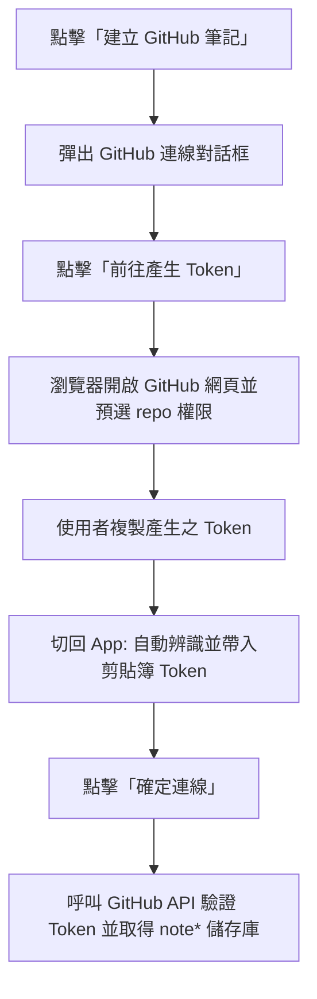
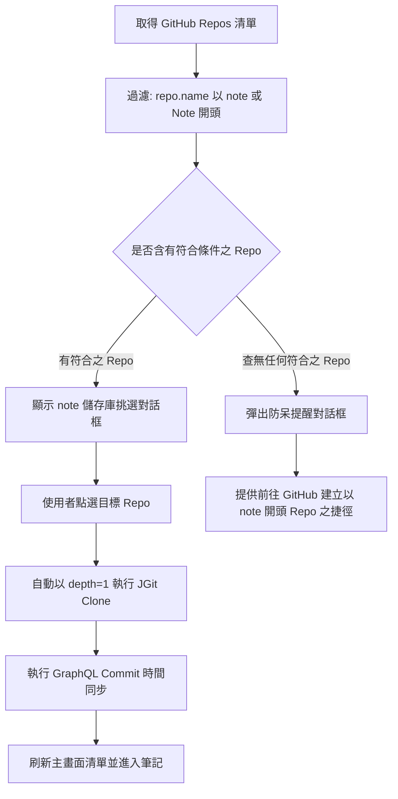
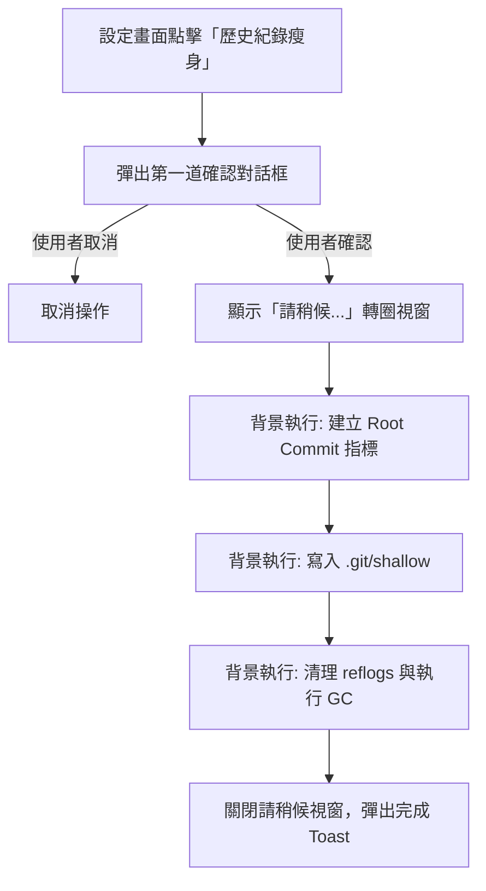

# github-integration Specification

## Purpose

定義 InMethodGitNoteTaking 應用程式中「建立 GitHub 筆記」功能、GitHub 授權管理、`note*` 儲存庫過濾挑選、GraphQL 檔案真實 Commit 時間同步、本地端歷史瘦身 (Purge) 以及多語系 Google Play 發布規範。

## Requirements

### Requirement: 主選單建立 GitHub 筆記入口
主畫面右上角「建立」選單 MUST 包含「建立 GitHub 筆記」選項，配置 GitHub Octocat 圖示，並依序置於選單最底端（排序順序：建立本地筆記 $\rightarrow$ 下載遠端筆記 $\rightarrow$ 建立 GitHub 筆記）。點擊後觸發 GitHub 連線流程。

#### Scenario: 點選主選單之建立 GitHub 筆記
- **WHEN** 使用者在主畫面點開「建立」選單並選擇「建立 GitHub 筆記」
- **THEN** 系統開啟 GitHub 連線引導對話框

### Requirement: GitHub Token 獲取與剪貼簿自動辨識
系統 MUST 提供【前往產生 Token】按鈕，自動開啟 GitHub 官方 PAT 建立頁面，並預先勾選所需之權限（`repo` 與 `read:user`）與填妥描述。當使用者產生 Token 複製並切回 App 時，系統 MUST 自動偵測剪貼簿內容並填入 Token 輸入框。

#### Scenario: 成功透過 Token 取得儲存庫
- **WHEN** 使用者輸入或由剪貼簿帶入有效之 GitHub Token 並點擊「確定連線」
- **THEN** 系統透過 API 獲取使用者的 Repository 清單並進入篩選流程

### Requirement: note 前綴儲存庫過濾與選取
系統獲取使用者的 Repository 清單後，MUST 自動過濾名稱開頭為 `note`（不區分大小寫，例如 `note-work`、`NoteTaking`）之儲存庫並呈現於對話框供使用者挑選。使用者挑選後，系統 MUST 自動帶入 Repo 資訊、Username 與 Access Token 執行 JGit Clone 下載、進行時間校正並立即刷新主畫面清單。

#### Scenario: 選擇筆記儲存庫並克隆
- **WHEN** 使用者從過濾清單中選擇一個 note 開頭之儲存庫
- **THEN** 系統以 `depth = 1` 完成 Clone，完成 GraphQL 時間校正後直接在主畫面顯示

### Requirement: GraphQL 單次批次 Commit 時間同步
在淺層下載（`depth = 1`）的前提下，系統 MUST 透過 GitHub GraphQL API 批次查詢每個檔案在遠端之真實最後 Commit 時間（`committedDate`），並將時間寫入本機檔案 `setLastModified(epochMilli)`。所有時間同步作業 MUST 在進度對話框關閉前 100% 完成。

#### Scenario: 筆記檔案時間校正
- **WHEN** GitHub 筆記 Clone 完成
- **THEN** 系統發送單次 GraphQL 請求取得各檔案最後 Commit 時間並更新檔案屬性

### Requirement: 本地端歷史紀錄瘦身 (Purge to Depth = 1) (實驗中)
系統 MUST 在「設定（Settings）」最下方提供【歷史紀錄瘦身 (保留單一版本) (實驗中)】功能。使用者點擊並確認後，系統 MUST 在本地離線建立 Orphan Root Commit，將本機歷史紀錄重置為單一版本（`depth = 1`）並執行垃圾回收（GC），釋放手機磁碟空間。執行過程 MUST 具備確認對話框與請稍候進度對話框防呆機制。

#### Scenario: 執行本地歷史瘦身
- **WHEN** 使用者在設定中點擊歷史瘦身並確認
- **THEN** 系統在背景將所有本地儲存庫瘦身為單一版本並釋放空間

### Requirement: 多語系支援與 Google Play 發布標準
所有介面字串 MUST 支援繁體中文（台灣）、繁體中文（香港）、簡體中文、日文、英文 5 國語言。每次版本升級時 MUST 維護 `CHANGELOG.md` 並同步覆蓋 `distribution/whatsnew/` 下之 5 國語系 Play 商店發布檔案（字數均限制在 500 字元內）。
