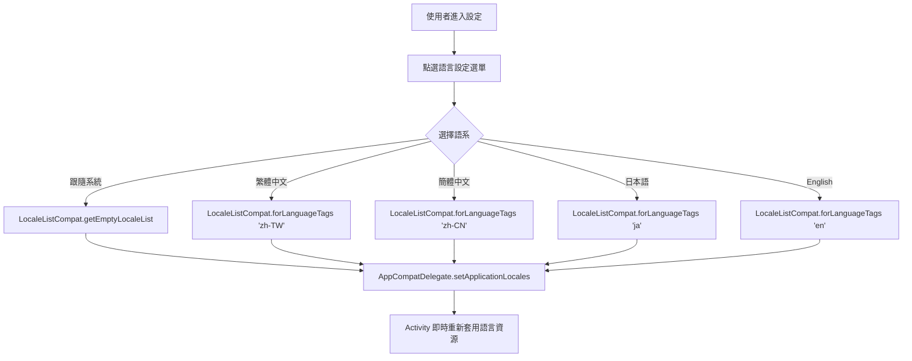

# language-selection Specification

## Purpose

定義 InMethodGitNoteTaking 應用程式在偏好設定中提供自由切換語系之選單架構、支援語系代碼與即時切換之行為規範。

## Requirements

### Requirement: 偏好設定語言切換選單
偏好設定 MUST 提供語言選單 (ListPreference)，包含 5 個標準選項：跟隨系統 (預設)、繁體中文、簡體中文、日本語與 English，並在使用者選擇後即時套用。

#### Scenario: 選擇繁體中文即時生效
- **WHEN** 使用者在設定中選取「繁體中文」
- **THEN** 系統將應用程式語系切換為 zh-TW 並即時更新畫面文字

#### Scenario: 選擇跟隨系統恢復預設
- **WHEN** 使用者在設定中選取「跟隨系統」
- **THEN** 系統恢復依據使用者裝置系統語言自動套用對應語系
