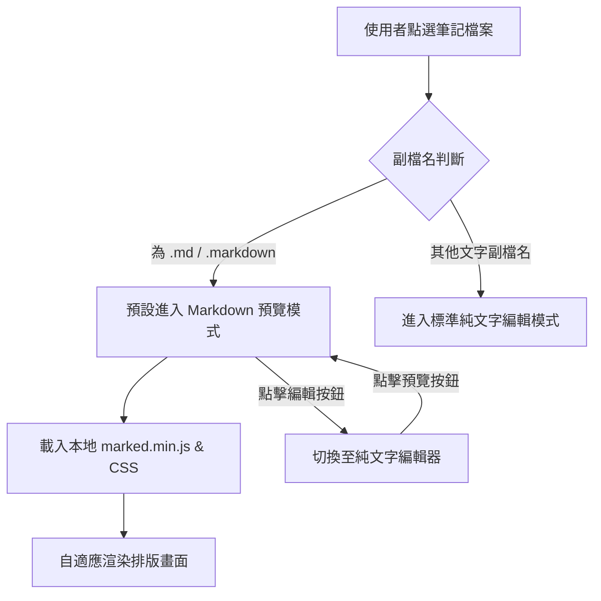

## Purpose

提供 InMethodGitNoteTaking 應用程式中 Markdown (.md / .markdown) 筆記之 100% 本地離線視覺化美化渲染、手機自適應排版、以及「預覽/編輯」雙模式無縫切換之完整行為規範。

## Requirements

### Requirement: Markdown 筆記離線視覺化預覽渲染
應用程式 MUST 支援在檢視 `.md` 或 `.markdown` 檔案時，透過 100% 本地離線之解析引擎將原始 Markdown 語法轉換為美觀之視覺化排版，包含標題（H1~H6）、粗體、斜體、刪除線、清單方框（Checkbox）、表格、程式碼區塊及本地相對路徑圖片。



#### Scenario: 成功預覽 Markdown 語法
- **WHEN** 使用者在檔案清單中點選副檔名為 `.md` 或 `.markdown` 之檔案
- **THEN** 系統預設以視覺化預覽模式呈現，所有標題、清單、表格與代碼區塊正確渲染排版且自適應螢幕寬度

#### Scenario: 本地圖片與表格自適應縮放
- **WHEN** Markdown 筆記中包含大型圖片或多欄位表格
- **THEN** 圖片最大寬度限制於手機螢幕寬度內（`max-width: 100%`），表格提供內部獨立水平滑動，確保頁面不破版

### Requirement: 預覽與編輯雙模式無縫切換
應用程式 MUST 在檢視 Markdown 筆記時於工具列提供切換控制項，允許使用者在「視覺化預覽模式」與「原始文字編輯模式」之間自由即時切換，且切換時不可遺失任何已輸入之文字內容。

#### Scenario: 點擊切換進入編輯模式
- **WHEN** 使用者在 Markdown 預覽模式下點擊工具列之「編輯 (✏️)」按鈕
- **THEN** 系統即時切換至純文字編輯框，並填入當前筆記之最新原始 Markdown 內容供使用者修改

#### Scenario: 編輯後切換回預覽模式
- **WHEN** 使用者在編輯模式下修改文字後點擊工具列之「預覽 (👁️)」按鈕
- **THEN** 系統即時將修改後之最新文字傳遞至渲染引擎重新繪製，並呈現最新之預覽畫面

### Requirement: 連結跳轉與雙向筆記導航
應用程式 MUST 支援在 Markdown 預覽模式下點擊連結：
1. 若為外部網頁連結（`http://` 或 `https://`），MUST 呼叫外部瀏覽器開啟。
2. 若為 Obsidian 雙向連結（`[[筆記名稱]]`）或本地 Markdown 相對路徑（如 `subfolder/note.md`），系統 MUST 自動在本地 Git 倉庫中定位並跳轉開啟該篇筆記。

#### Scenario: 點擊外網連結開啟瀏覽器
- **WHEN** 使用者在預覽畫面點擊指向外部網頁之超連結
- **THEN** 系統呼叫系統瀏覽器開啟該網頁

#### Scenario: 點擊內部雙向連結跳轉筆記
- **WHEN** 使用者在預覽畫面點擊 `[[筆記名稱]]` 或本地 `.md` 檔案連結
- **THEN** 系統自動定位本地 Git 倉庫中對應之檔案並在 App 內載入檢視

### Requirement: 編輯器全螢幕滿版與空白區域可編輯性
應用程式 MUST 確保文字編輯畫面在各種手機螢幕尺寸與系統導航列環境下 100% 垂直滿版，當筆記內容較短時，點擊編輯區任意空白位置 MUST 能正確聚焦並啟動軟鍵盤進行文字輸入。在預覽模式下自動隱藏底部相片附件橫條以最大化閱讀空間；切換至編輯模式時才展開附件橫條。

#### Scenario: 短筆記點擊空白處編輯
- **WHEN** 使用者開啟只有 1~2 行文字之短筆記並點擊畫面中下方空白區域
- **THEN** 文字編輯框正確取得焦點（Focus）並彈出輸入法軟鍵盤供使用者編輯輸入

#### Scenario: 預覽與編輯模式之附件欄自動收合
- **WHEN** 使用者在預覽模式與編輯模式之間切換
- **THEN** 預覽模式隱藏底部相片附件列，編輯模式顯示相片附件列

### Requirement: Mermaid 視覺化向量圖表離線渲染
應用程式 MUST 支援在 Markdown 預覽模式下將 ```` ```mermaid ```` 語法區塊（如流程圖 flowchart、循序圖 sequenceDiagram、圓餅圖 pie 等）離線繪製為互動向量 SVG 圖表，支援深淺色自適應與圖表橫向捲動防破版，且在語法異常時提供優雅降級。

#### Scenario: 成功繪製 Mermaid 流程圖
- **WHEN** Markdown 筆記中包含 ```` ```mermaid ```` 流程圖或循序圖語法
- **THEN** 系統透過本地 `mermaid.min.js` 自動將其繪製為 SVG 向量圖表並置中呈現

#### Scenario: 夜間模式圖表主題適配
- **WHEN** 系統處於夜間深色模式
- **THEN** Mermaid 圖表節點與線條自動採用暗黑高對比配色
