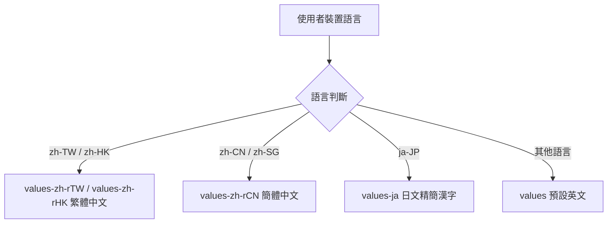

# Multilingual Support (多語系國際化支援規範)

## Purpose

定義 InMethodGitNoteTaking 應用程式之多語系國際化架構規範，支援繁體中文（台灣/香港）、簡體中文、日語與英文，並確保介面排版相容性。

## Requirements

### Requirement: 多語系資源覆蓋與無跑版相容
應用程式 MUST 提供完整的在地化語系資源檔，包含繁體中文、簡體中文、日文與英文，並在所有 UI 畫面上採用自適應與精簡詞彙以防止文字截斷或排版錯亂。

#### Scenario: 簡體中文環境完整顯示
- **WHEN** 使用者裝置語言設定為簡體中文 (zh-CN)
- **THEN** 應用程式所有介面文字（包含按鈕、選單、對話框與權限說明）必須呈現簡體中文

#### Scenario: 日文環境完整顯示且無跑版
- **WHEN** 使用者裝置語言設定為日文 (ja)
- **THEN** 應用程式所有介面文字必須呈現日文，且使用精簡漢字詞彙避免文字被切斷

#### Scenario: 英文與繁體中文預設支援
- **WHEN** 使用者裝置為繁體中文或預設英文環境
- **THEN** 系統正確呈現對應語言之字串資源
