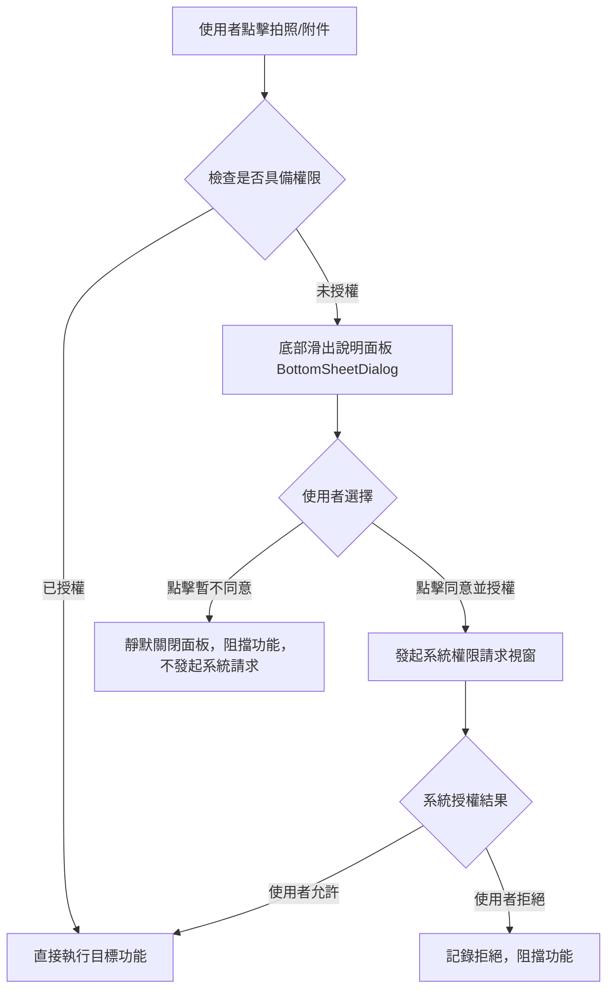

# Permission Handling (權限處理與前置告知規範)

## Purpose

定義 InMethodGitNoteTaking 應用程式針對危險權限的前置說明告知（BottomSheet 底部卡片面板）、按需請求、靜默拒絕阻擋、事後再次觸發與系統設定頁引導之行為規範。

## Requirements

### Requirement: 底部面板前置說明與按需請求
當使用者觸發需要危險權限（如相機、媒體讀取）之功能且尚未授權時，系統 MUST 先自畫面底部滑出卡片式前置說明面板 (BottomSheetDialog)，清楚揭露權限用途與原因，並依據使用者選擇決定是否向系統發起請求。

#### Scenario: 首次或未授權點擊功能時顯示底部說明面板
- **WHEN** 使用者在未授權狀態下點擊「拍照存檔」或「新增附件」
- **THEN** 系統必須自底部滑出卡片說明面板，不得直接調用系統原生權限請求視窗

#### Scenario: 使用者同意前置說明後發起系統請求
- **WHEN** 使用者在底部說明面板中點擊「同意並授權」
- **THEN** 系統向 Android 系統發起該權限的原生請求

#### Scenario: 使用者不同意前置說明時靜默關閉面板
- **WHEN** 使用者在底部說明面板中點擊「暫不同意」
- **THEN** 系統靜默關閉面板，絕對不可向 Android 系統發起權限請求，並阻擋該功能的執行

### Requirement: 事後再次觸發與永久拒絕引導
當使用者先前已拒絕權限而事後再次觸發該功能時，系統 MUST 再次檢查權限並給予適當提示；若權限已被永久拒絕，系統 MUST 透過底部面板引導使用者至系統設定頁開啟權限。

#### Scenario: 再次觸發未授權功能時提示
- **WHEN** 使用者再次點擊未授權之拍照或附件功能
- **THEN** 系統再次彈出底部說明面板提供授權管道

#### Scenario: 永久拒絕時跳轉系統設定頁
- **WHEN** 使用者點擊「不再詢問」後再次觸發該功能
- **THEN** 系統以底部面板顯示「需要開啟權限」說明，並在使用者點擊「前往設定」後跳轉至該 App 的系統設定頁面
