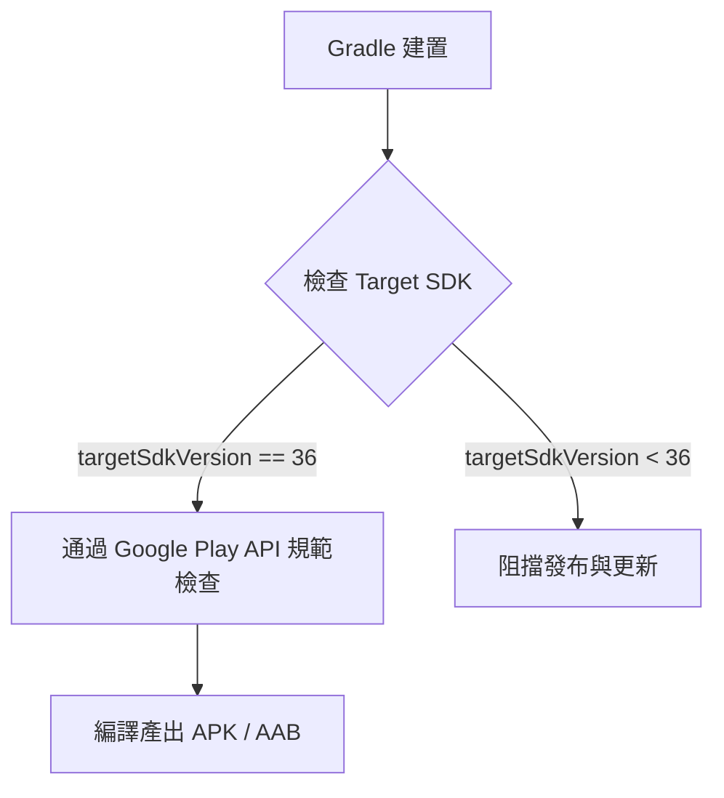

# platform-compatibility Specification

## Purpose

定義 InMethodGitNoteTaking 應用程式針對 Android 16 (API 級別 36) 的目標相容性規範、建置設定要求與執行期系統整合標準。

## Requirements

### Requirement: 目標 API 級別規範與建置配置
應用程式 MUST 將 `targetSdkVersion` 設定為 36 (Android 16)，以完全符合 Google Play 最新安全政策要求，並且在 Gradle 建置配置中顯式開啟必要的建置特性。

#### Scenario: 驗證 Target SDK 級別為 36
- **WHEN** 執行專案打包與檢查 `app/build.gradle`
- **THEN** `targetSdkVersion` 必須明確設定為 `36`，且 `compileSdkVersion` 為 `36`

#### Scenario: 驗證 BuildConfig 產生設定
- **WHEN** 執行專案編譯程序
- **THEN** `buildFeatures.buildConfig` 必須為 `true`，以確保 BuildConfig 能正常生成且無 AGP 警告

### Requirement: Android 16 執行期與系統相容性
應用程式 MUST 在 Android 16 (API 36) 設備上穩定運作，包含完整的 Edge-to-Edge 邊到邊視窗邊距適配、16KB 記憶體分頁相容，以及預測性返回導航支援。

#### Scenario: 視窗邊距與邊到邊佈局適配
- **WHEN** 應用程式在 Android 15/16 設備上啟動任何 Activity 畫面
- **THEN** 系統必須正確透過 WindowInsets Controller 處理 status bar 與 navigation bar 的 Insets，防止畫面內容被系統導航列或瀏海遮擋

#### Scenario: 檔案儲存與 Git 同步操作
- **WHEN** 使用者進行遠端 Git 儲存庫同步或本機筆記存取
- **THEN** 應用程式必須在應用程式專屬目錄與授權路徑下正常讀寫檔案，無權限拒絕異常
